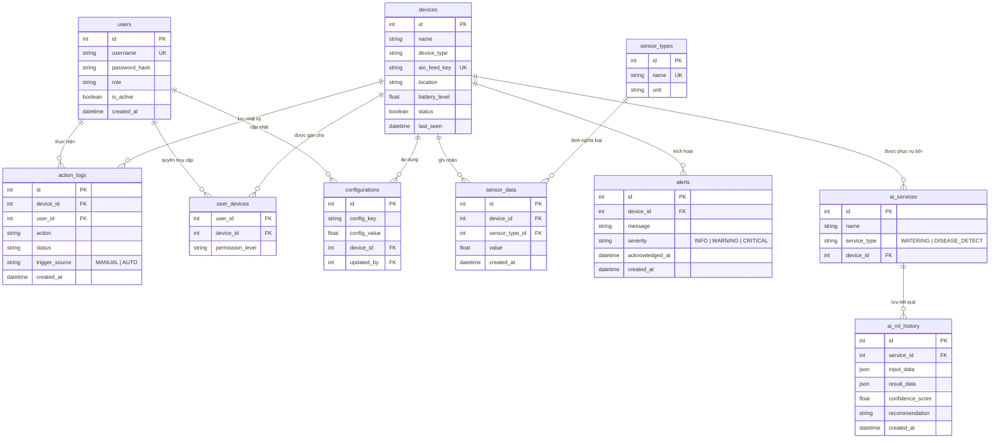

# ĐẶC TẢ CHI TIẾT CƠ SỞ DỮ LIỆU SMARTFARM IOT

---

## 1. TỔNG QUAN HỆ THỐNG
Cơ sở dữ liệu được thiết kế theo hướng **Modular Architecture**, tách biệt rõ ràng giữa:
*   Quản lý thiết bị IoT & Vận hành thực tế.
*   Giám sát dữ liệu cảm biến & Cảnh báo.
*   Phân tích dữ liệu bằng Trí tuệ nhân tạo (AI Services).
*   Quản trị người dùng & Phân quyền.

---

## 2. SƠ ĐỒ THỰC THỂ MỐI QUAN HỆ (ERD)

---

## 3. TỪ ĐIỂN DỮ LIỆU (DATA DICTIONARY)

### 3.1 Nhóm Quản trị (Admin & Auth)
| Bảng | Cột | Kiểu | Ràng buộc | Mô tả |
| :--- | :--- | :--- | :--- | :--- |
| **users** | `id` | Integer | PK | Khóa chính. |
| | `username` | String | UK, Not Null | Tên đăng nhập. |
| | `role` | String | Default: 'FARMER'| Vai trò: ADMIN hoặc FARMER. |
| **user_devices**| `user_id` | Integer | FK | Liên kết tới users. |
| | `device_id` | Integer | FK | Liên kết tới devices. |
| | `permission_level`| String | | Cấp độ: VIEW, OPERATOR, ADMIN. |
| **configurations**| `config_key` | String | Not Null | Tên cấu hình (VD: `TEMP_MAX`). |
| | `config_value`| Float | Not Null | Giá trị cài đặt. |

### 3.2 Nhóm Vận hành IoT (IoT Operation)
| Bảng | Cột | Kiểu | Ràng buộc | Mô tả |
| :--- | :--- | :--- | :--- | :--- |
| **devices** | `id` | Integer | PK | Khóa chính. |
| | `aio_feed_key`| String | UK, Not Null | Khóa Adafruit IO tương ứng. |
| | `battery_level`| Float | | % Pin của thiết bị. |
| | `last_seen` | DateTime | | Lần cuối thiết bị trực tuyến. |
| **action_logs** | `id` | Integer | PK | Khóa chính. |
| | `action` | String | | Hành động (ON/OFF). |
| | `trigger_source`| String | | Nguồn: MANUAL hoặc AUTO. |
| | `status` | String | | SUCCESS hoặc FAILED. |

### 3.3 Nhóm Giám sát (Monitoring)
| Bảng | Cột | Kiểu | Ràng buộc | Mô tả |
| :--- | :--- | :--- | :--- | :--- |
| **sensor_types** | `id` | Integer | PK | Khóa chính. |
| | `name` | String | UK | Tên loại cảm biến. |
| | `unit` | String | | Đơn vị tính (°C, %, lux). |
| **sensor_data** | `id` | Integer | PK | Khóa chính. |
| | `value` | Float | Not Null | Giá trị đo được thực tế. |
| **alerts** | `id` | Integer | PK | Khóa chính. |
| | `severity` | String | | Mức độ: INFO, WARNING, CRITICAL. |

### 3.4 Nhóm Trí tuệ nhân tạo (AI Services)
| Bảng | Cột | Kiểu | Ràng buộc | Mô tả |
| :--- | :--- | :--- | :--- | :--- |
| **ai_services** | `id` | Integer | PK | Khóa chính. |
| | `service_type`| String | | WATERING hoặc DISEASE_DETECT. |
| **ai_ml_history**| `id` | Integer | PK | Khóa chính. |
| | `input_data` | JSON | | Dữ liệu thô đưa vào AI. |
| | `result_data` | JSON | | Kết quả phân tích từ AI. |
| | `recommendation`| String | | Lời khuyên cho người dùng. |

---

## 4. CHI TIẾT MỐI QUAN HỆ (RELATIONSHIPS)
1.  **Một-Nhiều (1:N):**
    *   Một thiết bị (`devices`) có thể có nhiều dịch vụ AI (`ai_services`).
    *   Một dịch vụ AI (`ai_services`) ghi nhận nhiều lượt dự đoán (`ai_ml_history`).
    *   Một thiết bị (`devices`) sinh ra nhiều lượt dữ liệu (`sensor_data`) và hành động (`action_logs`).
2.  **Nhiều-Nhiều (N:N):**
    *   Người dùng (`users`) quản lý nhiều thiết bị (`devices`) thông qua bảng trung gian `user_devices`.
3.  **Tách biệt logic:** Bảng `action_logs` và `ai_ml_history` **không tham chiếu trực tiếp**, đảm bảo module vận hành và module phân tích hoạt động độc lập, giảm thiểu lỗi dây chuyền.

---

## 5. TÍNH NĂNG KỸ THUẬT NỔI BẬT
*   **Modularization:** Dễ dàng thêm các loại AI mới bằng cách định nghĩa trong `ai_services`.
*   **Integrity:** Các ràng buộc khóa ngoại (Foreign Key) đảm bảo dữ liệu không bị mồ côi.
*   **Audit Trail:** Mọi hành động của hệ thống đều được lưu vết trong `action_logs` và `alerts`.
*   **JSON Support:** Linh hoạt trong việc lưu trữ kết quả AI không cấu trúc.
